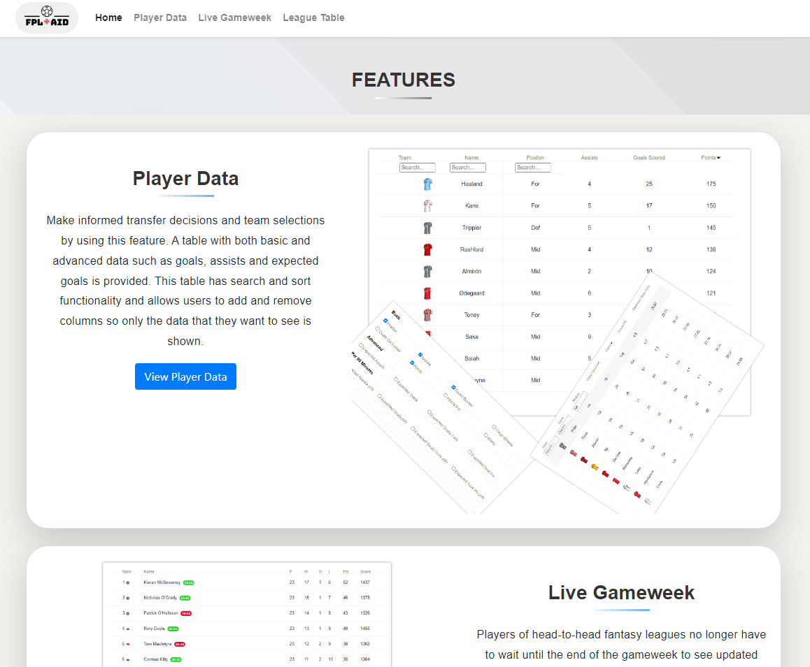
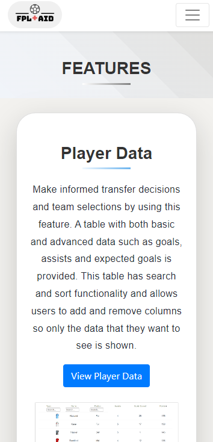
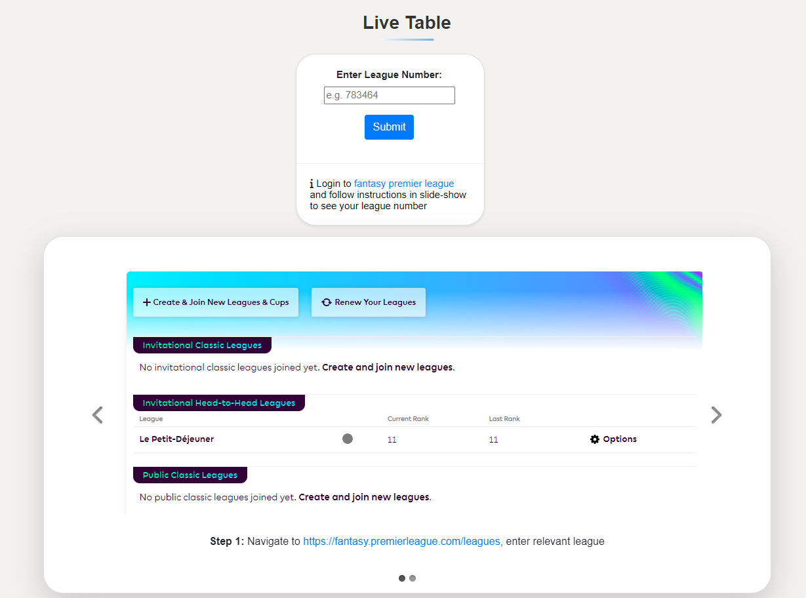
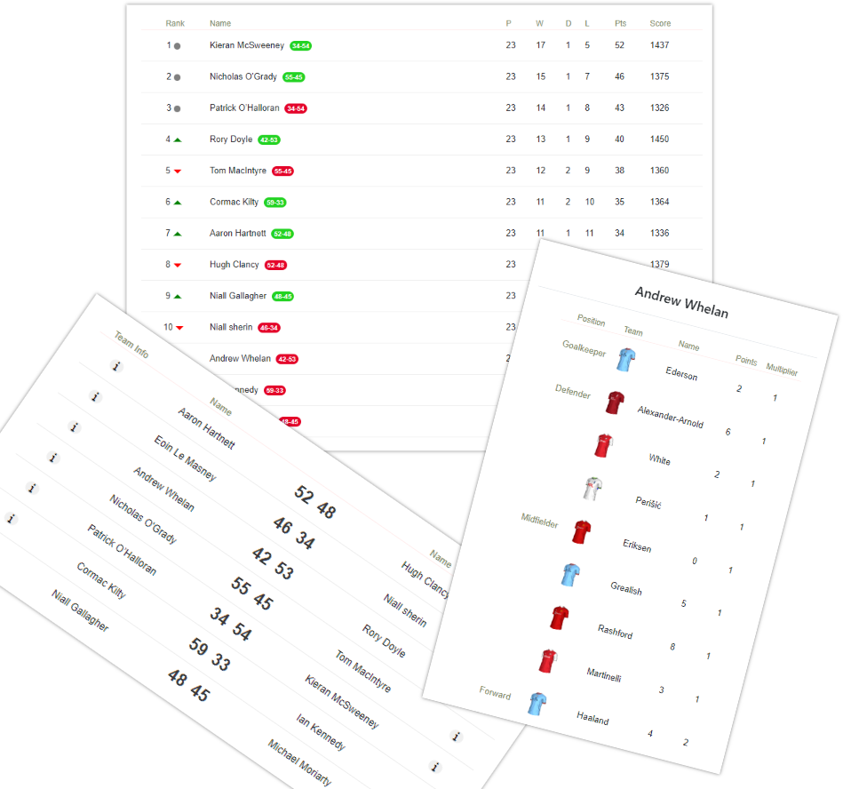
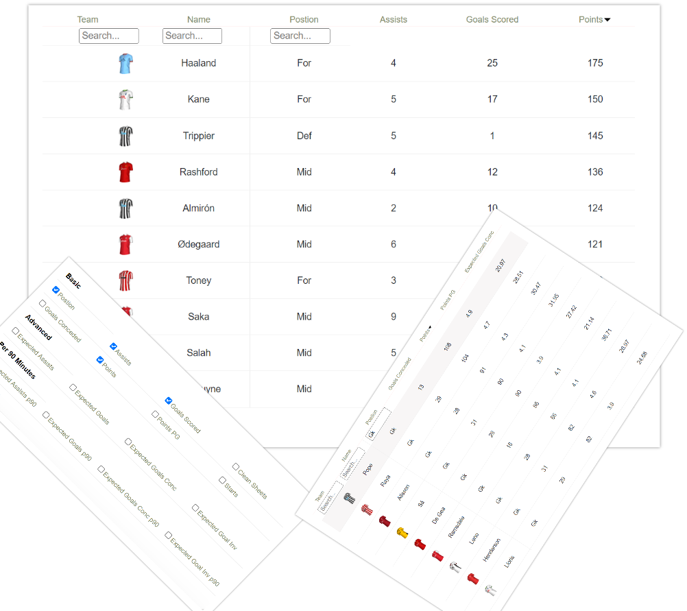
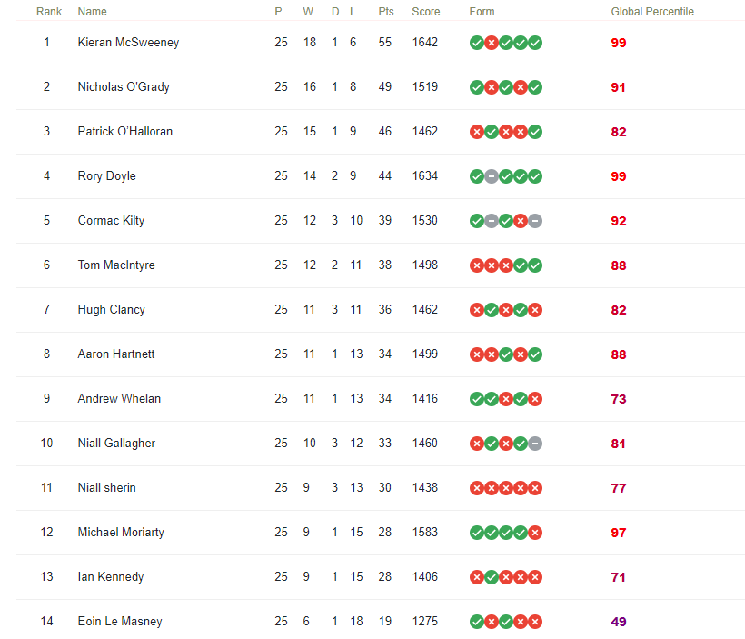
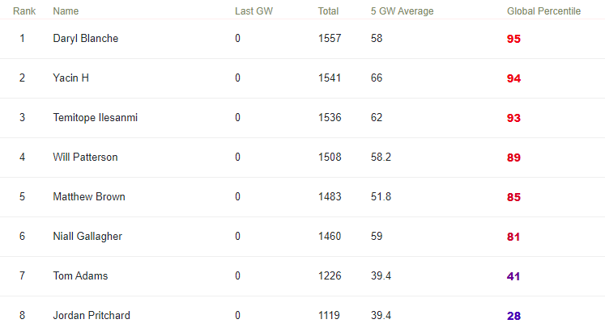

<p float="center">
  <br>
   
</p>

# Fantasy Premier League Aid

A web application which provides data and insights to players of fantasy premier league. This web app has both desktop and mobile compatibility.

## Overview

#### Usage

Clone it to a local repository:

```
$ git clone  https://github.com/awhelanUCD/Fantasy-Premier-League-Aid-public.git
```

Enter the directory `./config` and execute the script `create_globalDefinitions.py` in order to update global variables needed to run this web app:
```
$ python create_globalDefinitions.py
```

Go into the project directory and run the command:

```
$ python manage.py runserver
```

Open `http://localhost:3000` 

### Security

If a user wishes to deploy this web app, a new security key should be generated. To do so run the following commands to generate a new security key:

```
$ python manage.py shell
>>> from django.core.management.utils import get_random_secret_key
>>> print(get_random_secret_key())
```
Copy and paste the generated security key into the security variable in `./config/settings.py`

```
# SECURITY WARNING: keep the secret key used in production secret!
SECRET_KEY = 'ki$sbha*lcx^m@8qdlpp90h_v8@dy1!nrmwu#+lq&yg=*rd5+c'
```

#### Requirements

- asgiref==3.6.0
- certifi==2022.12.7
- charset-normalizer==3.0.1
- Django==4.1.6
- idna==3.4
- numpy==1.24.2
- pandas==1.5.3
- Pillow==9.4.0
- python-dateutil==2.8.2
- pytz==2022.7.1
- requests==2.28.2
- six==1.16.0
- sqlparse==0.4.3
- tzdata==2022.7
- urllib3==1.26.14

## Applications

#### Home Page

The home page provides a brief description of the components of this web app and links to them (desktop and mobile view shown here).

<p float="left">
  
  &nbsp &nbsp &nbsp &nbsp &nbsp
  
</p>

#### Live Gameweek

A weakness of the main fantasy premier league website is that it does not update league tables for head-to-head leagues until the end of the gameweek. Another drawback is that comparing the teams that different players in your league have picked requires opening up many different windows in your browser. This feature rectifies these issues by providing a live league table and team information for each player that can be quickly accessed and compared in one window. 

In this component, users are given a form prompting them to enter their league number as well as instructions for how to find this number.
<p> </p>
After the backend of this web-app receives this number, it check to see if the user has entered a valid league number of a head-to-head league and if so, generates the live gameweek page for the user. The team information for each fantasy league player can be seen by clicking the info button in the 'Team Info' column in the live fixture table. (To try out this feature, an example league number to use is: 783464)

<p float="left">
  <br>
   
</p>


#### Player Data

Making decisions on who to transfer and pick for your team is a key consideration for FPL players. This feature gives a table which provides various data such as goals, assists, expected goals and expected goals per 90 minutes for every premier league football player, helping users make informed decisions. This table can be searched, sorted and different data columns can be added and removed so that users only need to see the data they deem relevant.

<p float="left">
  <br>
   
</p>

#### League Table

This feature provides the current standings (as of the most recently concluded gameweek) for players of both classic and head-to-head fpl leagues. In addition to the information that is already provided on the fantasy premier league website, a form column and a global percentile column is given. For players of head-to-head leagues, the form column gives results from each players last five fixtures. For classic leagues, the average points from the last five gameweeks is provided.

As with the 'Live Gameweek' feature, the user is first given a form which prompts them to enter their league number. The backend then checks to see if this is a valid head-to-head or classic league, and if so returns a table with data associated with this league.

<p float="left">
  <br>
   
  &nbsp &nbsp &nbsp &nbsp &nbsp
   
</p>

## Python Modules

see  `./modules`

- checkLeagueType.py: contains a function which checks which type of league a given league number corresponds to
- classicLeagueClass.py: Contains the 'classicLeague' class which generate data for the 'League Table' app
- h2hClass.py: contains 'h2hLeague' and 'h2hLeague_live' classes which generate data for the 'League Table' and 'Live Gameweek' apps
- sharedFunctions/sharedFunctions.py: contains functions which are used by classicLeagueClass.py and h2hClass.py (also for potential future developments)

## Javascript Files
see  `./static/js`
- fancyTable.js: this is an augmented form of the [jquery.fancyTable](https://github.com/myspace-nu/jquery.fancyTable) plugin. It differs from the original form of this plugin in that it gives users an option to only apply search functionality to a certain number of columns, whereas the original form gives search functionality to all columns. In addition, html classes are added to these search bars so that they are integrated with the javascript function in playerData.js, which allows users to add and remove columns. If these classes were not added then the search bar which corresponds to a given column would not be hidden when adding and removing columns.
- leagueTable.js: this javascript file renders the league table in html using the data generated by h2hClass.py or classicLeagueClass.py
- liveTable.js: renders the live gameweek table, fixture table and team information boxes using the data generated by the 'h2hLeague_live' class in h2hClass.py
- playerData.js renders both the player data table and the checkBox table (which allows users to hide/show columns)

